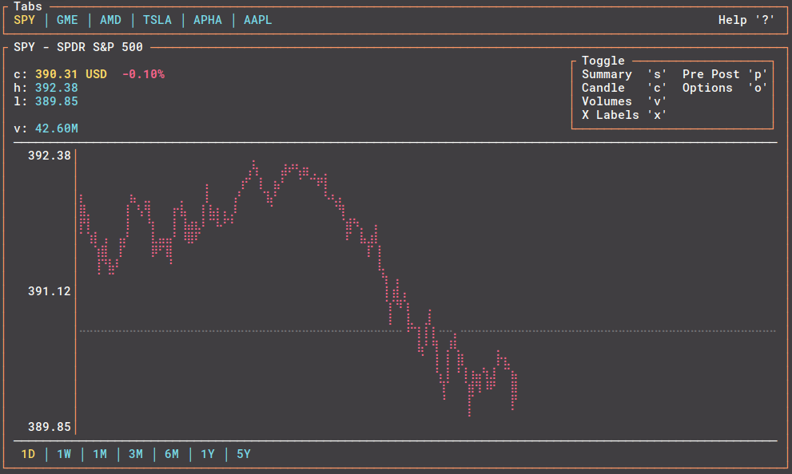

# tick-rs
[](https://github.com/tarkah/tickrs/actions)

Realtime ticker data in your terminal 📈 Built with Rust. Data sourced from Yahoo! Finance.

  - [Installation](#installation)
  - [Usage](#usage)
    - [Windows](#windows)
  - [Acknowledgments](#acknowledgments)



## Installation

### Binary

Download the latest [release](https://github.com/tarkah/tickrs/releases/latest) for your platform

### Cargo

```
cargo install tickrs
```

### AUR

```
yay -S tickrs-git
```

## Usage

```
tickrs 0.7.2
Realtime ticker data in your terminal 📈

USAGE:
    tickrs [FLAGS] [OPTIONS]

FLAGS:
    -h, --help               Prints help information
        --hide-help          Hide help icon in top right
        --hide-prev-close    Hide previous close line on 1D chart
        --hide-toggle        Hide toggle block
    -x, --show-x-labels      Show x-axis labels
        --summary            Start in summary mode
    -V, --version            Prints version information

OPTIONS:
    -s, --symbols <symbols>...                 Comma separated list of ticker symbols to start app with
    -t, --time-frame <time-frame>              Use specified time frame when starting program and when new stocks are
                                               added [default: 1D]  [possible values: 1D, 1W, 1M, 3M, 6M, 1Y, 5Y]
    -i, --update-interval <update-interval>    Interval to update data from API (seconds) [default: 1]
```

### Windows

Use [Windows Terminal](https://www.microsoft.com/en-us/p/windows-terminal-preview/9n0dx20hk701) to properly display this app.

## Acknowledgments
- [fdehau](https://github.com/fdehau) / [tui-rs](https://github.com/fdehau/tui-rs) - great TUI library for Rust
- [cjbassi](https://github.com/cjbassi) / [ytop](https://github.com/cjbassi/ytop) - thanks for the inspiration!
