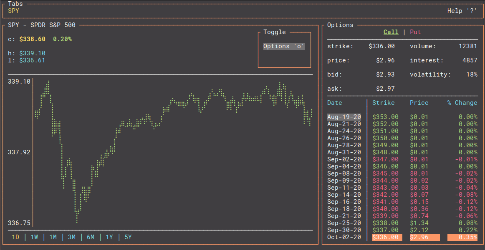

# tick-rs
[](https://dev.azure.com/tarkah/tickrs/_build/latest?definitionId=17&branchName=master)

Realtime ticker data in your terminal 📈 Built with Rust. Data sourced from Yahoo! Finance.

  - [Installation](#installation)
  - [Usage](#usage)
    - [Windows](#windows)
  - [Acknowledgments](#acknowledgments)

[](https://i.imgur.com/5srncFL.mp4)
*Click for full video*


## Installation

### Binary

Download the latest [release](https://github.com/tarkah/tickrs/releases/latest) for your platform

### Cargo

```
cargo install tickrs
```

## Usage

```
tickrs 0.3.2
Realtime ticker data in your terminal 📈

USAGE:
    tickrs [FLAGS] [OPTIONS]

FLAGS:
    -h, --help         Prints help information
        --hide-help    Hide help icon in top right
    -V, --version      Prints version information

OPTIONS:
    -s, --symbols <symbols>...    Comma separated list of ticker symbols to start app with
```

### Windows

Use [Windows Terminal](https://www.microsoft.com/en-us/p/windows-terminal-preview/9n0dx20hk701) to properly display this app.

## Acknowledgments
- [fdehau](https://github.com/fdehau) / [tui-rs](https://github.com/fdehau/tui-rs) - great TUI library for Rust
- [cjbassi](https://github.com/cjbassi) / [ytop](https://github.com/cjbassi/ytop) - thanks for the inspiration!